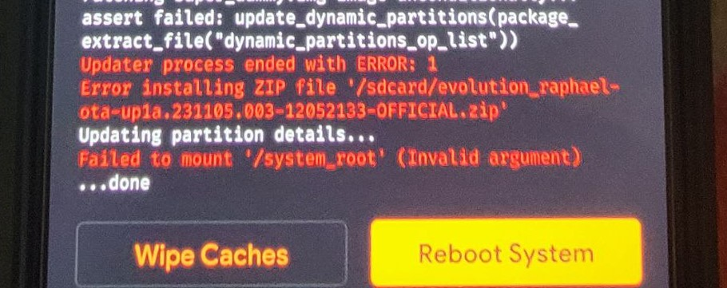

# Evolution X Dynamic System Partition (DSP) Flash Guide
<p align="center">
  
</p>

## Table of Contents

- [Downloads](#all-necessary-files)
- [Preparation](#preparation)
- [Recovery Flashing Steps](#flashing-dsp-recovery)
- [ROM Flashing Steps](#flashing-dsp-rom) (Using Recovery)
- [ROM Flashing Steps](#flashing-using-pc) (Using PC)
- [F2FS Conversion (Highly Recommended)](#f2fs-conversion-highly-recommended)

## Requirements
- Eyes and Brain.

## All Necessary Files
- [ROM](https://evolution-x.org/device/raphael)
- [Recovery](files/recovery_dynamic.zip?raw=true)
- [Legacy To Dynamic](files/legacy_to_dynamic.zip?raw=true)
- [Super Empty](files/super_empty.img?raw=true)
- [Firmware](https://xiaomifirmwareupdater.com/firmware/raphaelin/stable/V12.5.1.0.RFKINXM/) (India)
- [Firmware](https://xiaomifirmwareupdater.com/firmware/raphael/) (Global, China, Europe)
- [DFE](files/dfe.zip?raw=true) (Optional)


## Preparation

1. **Backup Your Data:**
   - Explore resources on Google or XDA for comprehensive guides on backing up your device data. Remember, formatting your data partition will erase internal files. It's crucial to perform this step to prevent potential boot issues due to old encryption.

2. **Bootloader and Recovery:**
   - Confirm that your bootloader is unlocked and use the recommended recovery.
   
3. **Persist Partition Backup:**
   - If not done previously, research guides on Google, XDA, or YouTube to back up your persist partitions.

4. **Download Required Files:**
   - Download all files listed in [here](#all-necessary-files). Choose firmware according to your device region. 

5. **Security Measures:**
   - Remove all fingerprints and PINs from your device.


## Flashing DSP Recovery

1. **Backup Data:**
   - Ensure your data is backed up before proceeding.

2. **Reboot to Recovery:**
3. **Format Data (type yes)**
4. **Flash Legacy to Dynamic ZIP File**
5. **Flash The Dynamic Recovery**

**You may face errors like this, just ignore and continue.**
<p align="center">
  
</p>

## Flashing DSP ROM

1. **Flash Android 11 Firmware:**
2. **Flash The Rom File**
3. **Format Data (type yes)**
   - You can skip this step only if you are already using a dynamic rom and decrypted.
5. **DFE Neo (Optional And Not Recommended)**
   - Flash DFE Neo if desiring to stay decrypted; otherwise, skip this step.
   - You have to flash DFE if you were decrypted before to stay decrypted.
6. **System Reboot:**
   - Reboot your system. Ignore warnings like "No OS Installed."


## Flashing using PC

- Make sure you have the latest ADB/Platform-tools
- You can use [this script](https://github.com/A7E28/AdbInstaller) to auto install ADB/Platform-tools

1. **Enter fastboot mode and Execute these commands:**
   - Check if your device is connected or not. If not then check your drivers again.
   ```bash
   fastboot devices
3. Now  extract the recovery_dynamic.zip and you will find an img file. run this cmd to flash the recovery:
   ```bash
   fastboot flash recovery <drag and drop that img file here>
4. Flash the super_empty file:
   ```bash
   fastboot wipe-super <drag and drop super_empty.img file here>
5. Now boot into your recovery
6. Flash ROM zip
7. Format Data
8. Reboot To System ( Ignore warnings like "No OS Installed.")

## F2FS Conversion (Highly Recommended)

- Switch to F2FS file system for enhanced performance after flashing the ROM. This step wipes your data partition, so perform it after flashing the ROM. Navigate to OFOX recovery menu > manage partition > select data > change fs > F2FS.

# Credits
- [Joey](https://t.me/shaughzam) for the ROM
- [Pranav Talmale](https://t.me/raphael_alpha) for legacy to dynamic file.
- [404](https://t.me/Laz_man) for recovery.

